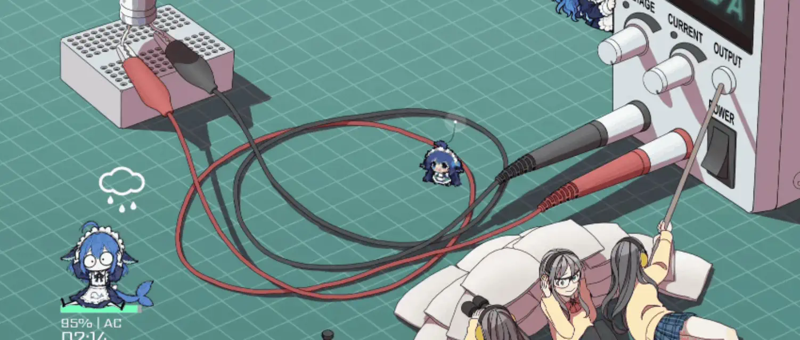

  

# BigFatFish

An animated companion for your mouse pointer on Android 16. No root required.

BigFatFish follows your pointer and reacts to mouse buttons. It uses an Android accessibility service and a local helper started with Android Debug Bridge (ADB). It does not read screen content or keyboard input.

## What it does

- Shows an animated character next to the mouse pointer.
- Offers motion, size, idle, and opacity controls.
- Lets you import your own PNG artwork pack.
- Observes mouse input without changing clicks or keyboard input.

## Get started

Build the app and helper. Enable the accessibility service. Start the helper with ADB. Follow the [setup and usage guide](SETUP.md) for commands and help.

## License and artwork

The application source uses the [Apache License 2.0](LICENSE). Character artwork belongs to its creator, xian_kuang. See [NOTICE](NOTICE) for artwork details.
